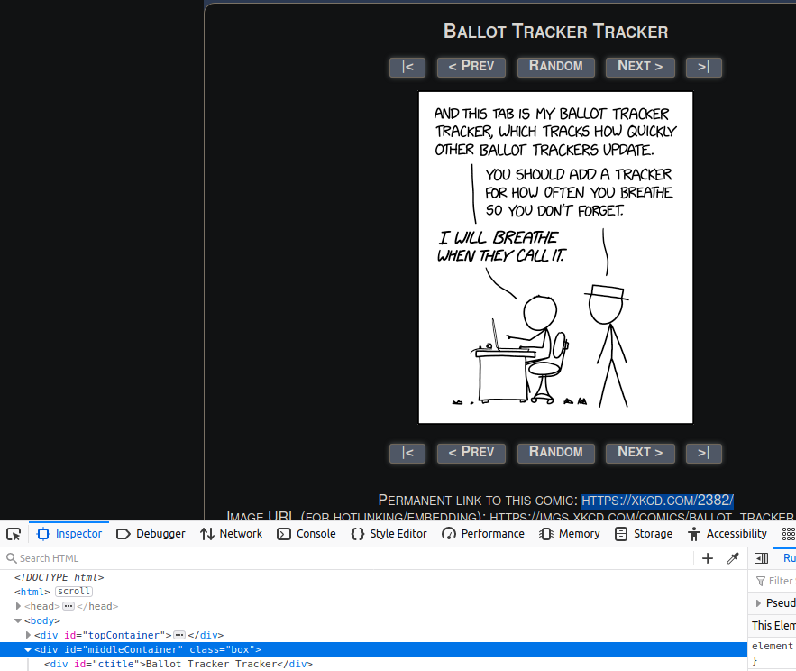
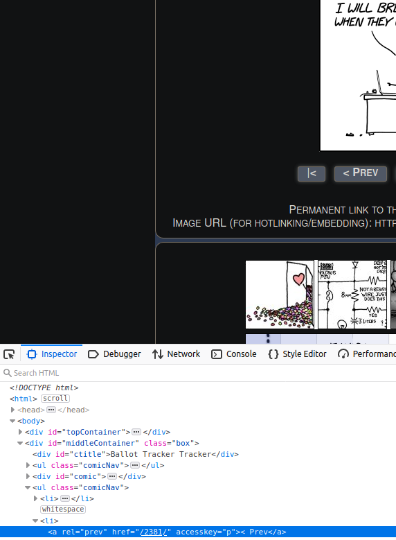

# Scraping the web or how to gather data when there are no datasets for the problem you envision solving.

Things to add:
* files and images
* proper proxies because most free proxies are already used up
    * difference between proxies and vpn
    * what types of proxies 
    * service used and how I set local keys
* proper pipelines when you have multiples files
    * proper mongodb checks
    * cool commands
* using more than one parse function for a given spider
* acting more human (injecting randomness) trough request and wait times
* rework how to link and rotate 


As a data science student you are given, and taught how to use, some of the greatest tools and techniques develloped by some of the brightest minds of our times to solve real world problems. While simple datasets (e.g. Iris) to extremely complex ones (AI2 hosted datasets) are readily available there will come a point where there isn't enough data available for what you are trying to archive or no such dataset exist, but the information is available online. This is where web scraping can help you bridge the gap since the web is essentially composed of words and pictures elements.

Webpage design and layout is not standard accross all websites and so you must manually parse through each website to identify how the information you seek is contained. If your goal is to gather data and maintain a data pipeline, for later usage, accross from 1 - 20 websites then you can do it manually, but any change done by a webpage you scrape will require code adjustment.


The following libraries are available to for you to use in a Python environment:
* [Requests](https://requests.readthedocs.io/en/master/)
    * extremely popular and capable
* [Beautiful Soup 4](https://www.crummy.com/software/BeautifulSoup/bs4/doc/)
    * Can only parse HTML and requires additional libraries (i.e. Selenium) to parse content created by JS;
    * easy and comprehensive documentation
* [Scrapy](https://scrapy.org/)
    * steep learning curve;
    * needs additional libraries (e.g. splah/Selenium) to handle very heavy JavaScipt pages;
    * synthax close to Django;
    * highly modular due to its python class usage;

This tutorial will focus on Scrapy due to its asynchronous capabilities, powerful command line capabilities, data pipelines and complementing libraries.

## Exploratory data analysis
Using a modern browser, I recommend Mozilla or Chrome, you can use the inspect element by right-clinking on the element you wish to inpect and then right-clicking on inspect element. You should be greated by this window in your browser.


From then on you can read what are the class variable names for the information you wish to extract from the webpage. This is extremely usefull as we will later use this technique in the command line to confirm that we have the right elements.

Other important elements in the inspector is Network (must reload the page, but enables you to see packages passed by the server) and accesibility (while meant to expose the page info to assistive technology it allows us to see the info in a JSON format).

## Before we write our first line of code

All that is required for a webpage to display its content proprely, albeit not prettily, is done through [Hyper Text Markup Language](https://developer.mozilla.org/en-US/docs/Learn/HTML/Introduction_to_HTML/HTML_text_fundamentals) (HTML) structure. HTML does so by "wrappping" the info between tags (i.e. \<p>first paragraph<\/p>). Unlike Extensible Markup Language (XML) HTML tags are defined and structured according to HTML5 layout and are standard across all webpages.


While not within the scope of this paper [Cascading Style Sheets](https://developer.mozilla.org/en-US/docs/Learn/CSS) (CSS) is used to change the font, color, spacing, etc. of all elements in a webpage and has very little to do with its functionality. This is where color, design and layout choices have the most impact on how a website appears to the user.

If we use a house as an example then the HTML language is used in the same way as beams and joists are used in the house to define the structure and support the entity. Using the same example, CSS is to a house what wall paint, flooring, hanged posters, etc. is to a house.

After HTML and CSS comes JavaScript (JS) which is used to program the behavior of a web page. JS is an important language in modern web creation, but it also creates additional challenges as an heavily scripted JS website can cause our spider to not be able to return the HMTL structure needed to scrape the website. Unfortunately, I do not fully grasp how modern website are dynamically generated, and I will have to learn JS in the future. Of note, PHP/Ruby/Ruby on Rail are also used to dynamically generate content on webpages.

## robot.txt
Robot exclusion standard or robots.txt is a standard used by all website and set the rules for the robot to follow. Scrapy spiders will always check the robots.txt file of a website before proceeding. 

In the robots.txt bellow the website indicates that all robots are asked to not proceed to the website
```
User-agent: *
Disallow: /
```
In the example bellow all robots are asked not to proceed to two domains of the webpage out of the entire website but can proceed to /tmp/rules.txt 
```
User-agent: *
Disallow: /cgi-bin/
Disallow: /tmp/
Allow: /tmp/rules.txt

```
The reason that websites do not ban all robots is because google and large hosting platforms use robots to index websites and the products displayed on these pages.This practice is often beneficial for sales when a customers types the name of a product in a search engine and the engine return a link to the product on your page comes up. This also part of how search engines rates websites. The best example of this ranking system is how every single cooking website have never ending story before the recipe since it increases their ranking and as a result their add revenue.


Of note it is possible to disable such rules with scrapy but doing so will most likely result in the blocking of your IP, but as we will see in this tutorial it is possible to mask your IP using proxies.

for more information consult: [/robot.txt](https://www.robotstxt.org/robotstxt.html)
For an entertaining example read [wikipedia.org/robots.txt](https://en.wikipedia.org/robots.txt)
## installing Scrapy 
Installing Scrapy is very [easy](https://docs.scrapy.org/en/latest/intro/install.html):
* if you are using a conda environment:
```
conda install -c conda-forge scrapy
```
* if you want a direct python install
```
pip install Scrapy
```
Both methods will work fine.
## setting our environment for the first time
Using any terminal on your machine type the following command in the directory of your choice
```
scrapy startproject {NameOfYourProject}
```
The following files and folders will be automatically created:
* spiders folder where all your spiders files will be located;
* [items.py](https://docs.scrapy.org/en/latest/topics/items.html): allows you to configure the extracted data python dictionaries;
* [middlewares.py](https://docs.scrapy.org/en/latest/topics/spider-middleware.html?highlight=spider-middleware): file where you can create custom functionalities for processing request. Refer to the documentation but also do not forget to enable them in the settings file afterward;
* [pipelines.py](https://docs.scrapy.org/en/latest/topics/item-pipeline.html?highlight=pipeline): python class allowing you to process response elements, must be enabled in the settings file afterward;
* [settings.py](https://docs.scrapy.org/en/latest/topics/settings.html): the most important file for our spider as it deeply alter its behavior.

All that you need to get started writing your first spider is to create a .py script in the spiders folder.
## Exploratory Analysis using command line
Let's get started using command line first 
```
scrapy shell https://xkcd.com/2382/
```
The most important thing is to see what response we get from the server. In our case its a 200 response but lookout for 404 and 500 errors.
```
# in our case
2020-11-07 20:53:35 [scrapy.core.engine] DEBUG: Crawled (200) <GET https://xkcd.com/2382/> (referer: None)
```
Since programming is an iterative process, the command line allows us to safely explore the server's answer without having to constantly ping the server. From then on, the world is our oyster and we can safely explore the data.

We will mainly use [CSS selectors](https://www.w3.org/TR/selectors-3/#selectors) which do not return support text nodes or attribute value but can do so using: 
```
::text or ::attr(name)
```
While I prefer CSS selector, you can also use .xpath() to select the xml node. Also CSS selectors uses xpath under the hood. I highly recommend this source when using [CSS](https://www.w3schools.com/cssref/css_selectors.asp).

let's find the XKCD number, title, image url, and hidden text. 
Using the element inspector in the browser we find that the title info is wrapped in id=title and subordinate to id=middleContaiter.


```
In [1]: response.css('#middleContainer #ctitle::text')
Out[1]: [<Selector xpath="descendant-or-self::*[@id = 'middleContainer']/descendant-or-self::*/*[@id = 'ctitle']/text()" data='Ballot Tracker Tracker'>]
```
This is not helpful since we want the information and not the entire container. We can use extract() or extract_first(), but they are old methods that have been superseeded with .get() and getall(). Of note you can index getall() like so:
```
response.css('SomeContent')[:2].getall()
```
```
# Title
In [2]: response.css('#middleContainer #ctitle::text').get()
Out[2]: 'Ballot Tracker Tracker'
```
Now that we successfully extracted the first element we can extract the rest. I highly recommend you try yourself extracting the information yourself before looking at the answers for you will remember the process much better.
```
# the image 
In [3]: response.css('#middleContainer #comic img::attr(src)').get()[2:]
Out[3]: 'imgs.xkcd.com/comics/ballot_tracker_tracker.png'

# the hidden text
In [4]: response.css('#middleContainer #comic img').re(r'title="(.*?)"')
Out[4]: ['Good luck to Democrats in the upcoming Georgia runoff elections, and to the Google Sheets SREs in the current run-on elections.']

# comic #
In [5]: response.css('#middleContainer ul li a::attr(href)')[1].re(r'(\d+)')
In [5]:['2381']
```
I highly recommend that you refresh your memory on [regex](https://regexone.com/lesson/line_beginning_end) and test them[beforehand](regex101.com/). Also a refresher on Python classes is not a bad idea either.

Now that we have succefully extracted all the information in the shell we are ready to write the script.
## writing our first spider
Now that we are familiar with the server's response we are ready to write out the script. We only need two things for that: a class and the parse method to process the spider's response.
```
import scrapy
import re

class PostsSpider(scrapy.Spider):
    # name required for scrapy when calling the crawl method
    name = 'xkcdScraper'
    start_urls = ['https://xkcd.com']

    def parse(self,response):

        # the 3 lines bellow extract the comic# and allows us to loop through the page (later)
        next_page = response.css('#middleContainer ul li a::attr(href)')[1].get()
        nextPageRegex = r'(\d+)'
        match = re.search(nextPageRegex,next_page)
        # create a generator for the reponse
        yield{
            'comic title' : response.css('#middleContainer #ctitle::text').get(),
            'comic number': int(match[0]),
            #'image link' : response.css('#middleContainer #comic img').re(r'imgs.+.jpg'),
            'image link' :response.css('#middleContainer #comic img::attr(src)').get()[2:],
            'hidden text' : response.css('#middleContainer #comic img').re(r'title="(.*?)"')
            #response.css('#middleContainer #comic img::attr(title)').get()
        }

```
With a terminal open in the location of our spider we passing the follow commands
```
# -o will output the results in a json file
scrapy crawl xkcdScraper -o xkcdResults.json
```
In the terminal it should return this:
```
2020-11-08 10:36:59 [scrapy.core.scraper] DEBUG: Scraped from <200 https://xkcd.com>
{'comic title': 'Ballot Tracker Tracker', 'comic number': 2381, 'image link': 'imgs.xkcd.com/comics/ballot_tracker_tracker.png', 'hidden text': ['Good luck to Democrats in the upcoming Georgia runoff elections, and to the Google Sheets SREs in the current run-on elections.']}
```
And opening the xkcdResults.json should display the exact same information.

Since our goal is to crawl an entire website without having define everysingle page's url we can loop the spider using the urljoin method and then issuing another reuest. Luckily for us the comic # is also used as page index so adding the following code in the class parse method should allow us to loop. You can confirm using the inspector tool in your browser.


```
        # now we want to loop

        # if we want to scrape the entire website
        # if next_page is not None:
            # next_page = response.urljoin(next_page)
            # yield scrapy.Request(next_page,callback=self.parse)


        # we are using the comic # as a way to stop
        if int(match[0]) > 2300:
            next_page = response.urljoin(next_page)
            yield scrapy.Request(next_page,callback=self.parse)
```
Scrapy schedules the scrapy.Request objects returned by the start_requests method of the Spider (in our case we chose to use start_urls as a shortcut). Upon receiving a response for each one, it instantiates Response objects and calls the callback method associated with the request (in this case, the parse method) passing the response as argument. The parse method will generate the information we seek and then generate a scrapy.Request which will then be processed by the parse method which is akin to a while loop.

## using item containers
So far we wrote our spider in a single script but as you realized this is messy. The general idea is Extracted data -> Temporary containers -> databse

In the items.py file you can add the following fields
```
class XkcdtestspiderItem(scrapy.Item):
    # define the fields for your item here like:
    #name = scrapy.Field()
    comicTitle = scrapy.Field()
    comicNumber = scrapy.Field()
    comicImageLink = scrapy.Field()
    comicHiddenText = scrapy.Field()
```
Back to our spider we need to import the method
```
from ..items import XkcdtestspiderItem
```
Then we create a class instance and modify the parse method accordingly
```
    def parse(self,response):

        comic = XkcdtestspiderItem()

        next_page = response.css('#middleContainer ul li a::attr(href)')[1].get()
        nextPageRegex = r'(\d+)'
        match = re.search(nextPageRegex,next_page)

        comic['comicTitle'] =  response.css('#middleContainer #ctitle::text').get()
        comic['comicNumber'] = int(match[0])
        comic['comicImageLink'] = response.css('#middleContainer #comic img::attr(src)').get()[2:]
        comic['comicHiddenText'] = response.css('#middleContainer #comic img').re(r'title="(.*?)"')

        yield comic
```
now instead of generating a dictionary we can simply yield the class instance comic
## Item pipelines
All we have done so far was to extract the data onto a .json/.xml/.csv file in the same folder of our spider.

Before storing the data into a database we need to have it run through the item pipeline.

Typical uses of item pipelines are:

   * cleansing HTML data
   * validating scraped data (checking that the items contain certain fields)
   * checking for duplicates (and dropping them)
   * storing the scraped item in a database
   * creating new field based on the data we recieved
First step is to uncomment the pipeline in settings
```
ITEM_PIPELINES = {
   'xkcdTestSpider.pipelines.XkcdtestspiderPipeline': 300,
}
```
The 300 number refers to the pipeline priority, and so if you have multiple pipelines you can dicate the order. Ensure that any futher pipelines created afterward are added in the setting files. 
When the parse method yield an item it will, if available, pass it to the pipeline for processing. To confirm that the pipeline receives the desired info we will write the following code:
```
from itemadapter import ItemAdapter

class XkcdtestspiderPipeline:
    def process_item(self, item, spider):
        for k,v in item.items():
            print(f'pipeline key: {k}; value: {v}')
        return item
```
Which returned:
```
pipeline key: comicTitle value: Ballot Tracker Tracker
pipeline key: comicNumber value: 2381
pipeline key: comicImageLink value: imgs.xkcd.com/comics/ballot_tracker_tracker.png
pipeline key: comicHiddenText value: ['Good luck to Democrats in the upcoming Georgia runoff elections, and to the Google Sheets SREs in the current run-on elections.']
```
## storing data in database
You can store the data from the pipeline into the following popular databases: sqlite3/MySQL/MongoDB. Due to the unstructured nature of scraping and its ever changing nature we will use NOSQL language.

First step is to [install](https://docs.mongodb.com/manual/administration/install-community/) MongoDB and then start it.
```
# starting mongoDB (systemd)
sudo systemctl start mongod
# confirm that mongoDB is active
sudo systemctl status mongod
# run mongo in shell
mongo
```
You want to look for the port MongoDB is using which is given after running mongo.
```
MongoDB shell version v4.4.1
# MongoDB is listening to prt 27017 of our local machine.
connecting to: mongodb://127.0.0.1:27017/
```
Confirm where the data will be located or [create](https://askubuntu.com/questions/982673/where-is-mongo-database-folder-on-the-filesystem) a new path
```
grep -i dbPath /etc/mongod.conf
```

Next install pymongo eitheir through pip or conda
```
conda install -c anaconda pymongo
pip install pymongo
```
Ensure that the pipeline is allowed in the setting file and after we need to modify the pipeline file
```
from itemadapter import ItemAdapter
import pymongo

class XkcdtestspiderPipeline:

    def __init__(self):
        # requires two arguments
        self.conn = pymongo.MongoClient(
            '127.0.0.1',
            27017
            )
        # creating the database
        db = self.conn['randallMunroe']
        # creating a table
        self.collection = db['webComic']

    def process_item(self, item, spider):
        
        self.collection.insert_one(dict(item))

        # testing
        # for k,v in item.items():
        #     print(f'pipeline key: {k}; value: {v}')
        return item
```
Accessing the info in [MongoDB shell](https://stackoverflow.com/questions/24985684/mongodb-show-all-contents-from-all-collections)
```
# start MongoDB
mongo
# see what DB are available
show dbs
# selecting our db
use randallMunroe
# show all tables in the db
show collections
# see all the data
db.webComic.find().pretty()
```
You should see the following in the in the MongoDB
```
{
	"_id" : ObjectId("5fa871fb6dd9181583093173"),
	"comicTitle" : "Ballot Tracker Tracker",
	"comicNumber" : 2381,
	"comicImageLink" : "imgs.xkcd.com/comics/ballot_tracker_tracker.png",
	"comicHiddenText" : [
		"Good luck to Democrats in the upcoming Georgia runoff elections, and to the Google Sheets SREs in the current run-on elections."
	]
}
```
Of note: more logic can be implemented when passing data to the database so that we do not pass duplicates of records already present in.
## Parameter setting (robot politeness)
Ultimately, unless your express goal is to create a Denial Of Service (DOS) attack,  you do not want your robot to negatively impact the performance of the website it is scraping the data from.

First and foremost obey websites /robots.txt rules
```
# enabled by default
ROBOTSTXT_OBEY = True
```
Identifying your robot and yourself
```
BOT_NAME = 'xkcdTestSpider'
USER_AGENT = 'XKCDfansAndCo-MyXKCDCrawler (ILoveXKCD@gmail.com)'
```
Since Scrapy spiders are incredibly fast and their asynchronus capibilites can create stresses you can tune the following parameters manually:
```
# Configure maximum concurrent requests performed by Scrapy (default: 16/max 32)
CONCURRENT_REQUESTS = 4 
DOWNLOAD_DELAY = 3 # Default is 0 second
```
Scrapy offers an automatic option through throttling
```
# AutoThrottle automatically adjusts the delays between requests according to the current web server load.
AUTOTHROTTLE_ENABLED = True
```
Programing a spider may require you to ping the samepage multiple time as your spider evolves. This may cause undue stress on the server at best and at worst get your IP banned. 
```
HTTPCACHE_ENABLED = True
```
If a website has an API please use it for it will most likely relieve some headache.

## Proxies/User agents (unpolite robot)
What we are doing is not very polite, but it is still important to be aware of its capabilities.
### User agents
As we learned in robots.txt, you can bypass websites restrcitions by using a different [user agent](https://developer.mozilla.org/en-US/docs/Web/HTTP/Headers/User-Agent). A user agent is a characteristic string that lets servers and network peers identify the application, operating system, vendor, and/or version of the requesting user agent. You can do so by modifying the robot user agent in the settings file. You can even trick websites into believing that you are google.
```
# Crawl responsibly by identifying yourself (and your website) on the user-agent
#USER_AGENT = 'xkcdTestSpider (+http://www.yourdomain.com)'
```
The other method is using several users agents to trick the website in thinking that the robot is from different computers. Luckily for us a package like this exists already exists and contains close to 2200 different user agent.
```
pip install scrapy-user-agents
```
Add the following code in the settings file
```
DOWNLOADER_MIDDLEWARES = {
    'scrapy.downloadermiddlewares.useragent.UserAgentMiddleware': None,
    'scrapy_user_agents.middlewares.RandomUserAgentMiddleware': 400,
}
```

If curious you can see yours [here](https://www.whatismybrowser.com/detect/what-is-my-user-agent)

### Proxies
The idea behind this is simple, we will use a different IP address so that we do not get our own IP address banned. You can also use a VPN. Essentially every request you make, will use a different IP. Similarly to user agents we can install the following [package](https://github.com/rejoiceinhope/scrapy-proxy-pool):
```
pip install scrapy_proxy_pool
```
Add the following lines in the settings file
```
PROXY_POOL_ENABLED = True
DOWNLOADER_MIDDLEWARES = {
    'scrapy_proxy_pool.middlewares.ProxyPoolMiddleware': 610,
    'scrapy_proxy_pool.middlewares.BanDetectionMiddleware': 620,
}
```
Please be aware that using proxies takes significantly longer than using a user agents since some ip addresses may not be working. You can also your own ip [addresses](https://free-proxy-list.net/)

## Challenges of scraping

The creation of robots in order to create your own data is a fascinating endaveour but also a manually intensive process. Using Convoluted [Neural Networks (CNN)](https://www.youtube.com/watch?v=q0lQAMqQViA) to not only get the data but also extract the data using Neuro-linguistic programming (NLP) would greatly increase the range of our spiders.

Lastly, the example we used, XKCD, is very friendly to beginners as it is mostly an HTML page but modern websites using JS framework can cause our robot to not recognize the data. Scrapy can be integrated by using [Splash](https://github.com/scrapy-plugins/scrapy-splash) and [Selenium](https://www.selenium.dev/), but it adds greater levels of complexity to our robot. I am unable, at the moment, to venture past as I require JS knowledge.
## Special thank you

I want to thank [buildwithpython](https://www.youtube.com/channel/UCirPbvoHzD78Lnyll6YYUpg) youtube channel, [Traversy Media](https://www.youtube.com/user/TechGuyWeb) youtube channel, [Scrapinghub](https://blog.scrapinghub.com/) blog and anyone who took some of their precious time to answer questions on stakOverflow. Without you I could not have grasped the concept of scrapy in the time required to write this paper.
## Closing statement

I am a student and future professional who is keen on learning, If you have any questions, or would like to point out any inaccuracies please email me.

Thank you for reading.

[Henri Vandersleyen](hvandersleyen@gmail.com)

Data science student at Lighthouse lab

